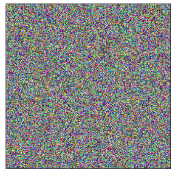
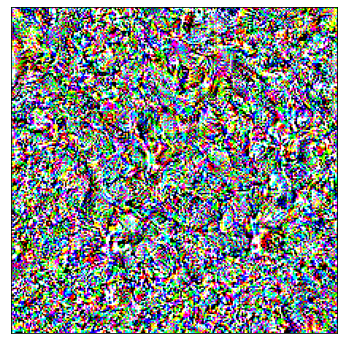
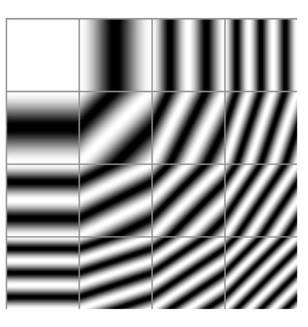
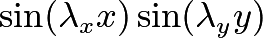
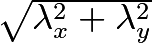
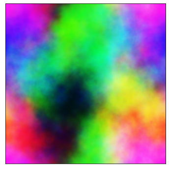

<!-- ---

 Sum 

--- -->

*This post was written based on my favourite parts of the [MLAB](https://www.redwoodresearch.org/community-and-team-growth) bootcamp.*

*To make it (hopefully) interesting for those with and without machine learning familiarity, background details are enclosed in **Background** collapsibles, and technical details are enclosed in **Technicality** collapsibles.*

If you believe AI (through machine learning, or otherwise) might transform society, you might also be concerned whether such transformation is very good or [very bad](https://en.wikipedia.org/wiki/Existential_risk_from_artificial_general_intelligence). One approach to working on this problem is *technical AI alignment*, which in this post I define to be working with existing ML systems in order to find and solve analogous problems to those that may arise within more powerful systems. The article has examples from each of element of {Computer vision, Natural langauge processing, Reinforcement learning} to give wide scope on where alignment problems can arise and be worked on.

This post is accompanied with a colab notebook [here](https://colab.research.google.com/drive/10DkmAwc7FXokD1_scwvvWEav0F9egtK5?usp=sharing).

## Interpretability 

---

<b>Background</b>

One problem with existing ML systems is that they are often used as a <i>black-box</i>, performing a task of use to us, while we don't understand exactly how it does this. A particularly scary <a href="https://www.pulmonologyadvisor.com/home/topics/practice-management/the-potential-pitfalls-of-machine-learning-algorithms-in-medicine/">example</a> of this involved software in medicine recommending patients with asthma were *less* likely to develop complications from pneumonia than the baseline of patients with pneumonia.

---

*Interpretability* work aims to understand what and how ML systems are learning from data. I look at both interpretability in computer vision and NLP. 

# Computer Vision 

*Just read [this distill article](https://distill.pub/2017/feature-visualization/), it's fantastic*

---

<b>Background</b>

I use computer vision to refer to machine learning systems trained on large datasets of images from the real world (natural images). These systems affect us daily (if we use facial recognition software to unlock our phones) and are likely (e.g self-driving cars) to be one of the most economically important application of ML in the near future. A look under the hood suggests that computer vision systems 'see' the world from how we do.

---

We can see this through feature visualization with optimization. We can isolate neurons[^fn1] in [InceptionV1](https://microscope.openai.com/models/inceptionv1?models.technique=deep_dream), a network trained to [classify images](https://en.wikipedia.org/wiki/ImageNet#History_of_the_ImageNet_challenge) and then optimise input images to maximise their sensitivity to such input images. The results are very unlike natural images, and offer an insight into the psychadelic world of the inside of computer vision models[^fn2]:

Optimized Image            |  Similar Dataset Examples
:-------------------------:|:-------------------------:
    |  

However, it's worth noting that this approach is *hard* to get working. Running optimization in the naivest way possible, initialising a random image and then optimizing for output in one of ImageNet's 100 classes results in ... something ... but certainly nothing like any natural image (from here on, all experiments can be repeated in the colab notebook):

Randomly initialised image            |  Naive optimisation, 1000 steps
:-------------------------:|:-------------------------:
    |  

A really nice partial solution is to optimize over the Fourier basis of the image rather than the natural pixel basis:

---

<b>Technicality</b>

In computer vision, we generally optimize over the <i>C x H x W</i> vector space of images, with one dimension per pixel per channel. However, this is a fairly unnatural basis over which to optimize, since it considers adjacent pixels completely independently, which in part causes the noisy, neon images seen above. If we instead consider the Fourier basis associated with the pixel basis, we have a basis (i.e we can reproduce any image) which, each individually are continuous images rather than isolated pixels:

This <i>still</i> leads to very noise images when initialised, however, since enough of a proportion of the Fourier basis still has a high frequency. We can mitigate this by rescaling a basis vector

by dividing by a factor of

,

the intuition being that this will cause the norms of the gradients of these 2D function to all be 1 at the origin.

The implementation of such a Fourier inversion are non-trivial: the discrete Fourier transform fundamentally operates on complex vector spaces, and our images only make sense as real vector spaces. There are <a href="https://pytorch.org/docs/stable/generated/torch.fft.irfft2.html">library functions</a> that work around this, yet it's a good <b>exercise</b> to consider:

Fix an integer <i>N</i>. Find the image of sequences of <i>N</i> reals under the inverse discrete Fourier transform.

---

Randomly initialised image, Fourier basis            |  Optimised, 1000 steps.
:-------------------------:|:-------------------------:
    |  <!-- 

# Natural Language Processing

*Just read [the Anthropic](https://transformer-circuits.pub/2021/framework/index.html), it's also fantastic*

---

<b>Background</b>

I use natural language processing to refer to machine learning systems trained on large amounts of text (from the internet). The resulting system could include autocompleters, as on mobile devices, or 'chat-bot's able to respond to a very large variety of prompts.

---

Interpretability is also important for <i>language models</a>, which aim to predict the next words in incomplete sentences, or produce further sentences complete sentences. There are very wide-ranging, often hilarious <a href="https://www.gwern.net/GPT-3-nonfiction">results</a> of such models, but they can be underwhelming and fragile as subtle changes to prompts change responses from nonsense to very impressive: for example, they are able to produce working solutions to unseen competitive programming problems of the form used for hiring programmers at any large tech company:

TODO EXAMPLE, FAILURE AND SUCCESS.

The workhorse behind the success of these models is the <i>transformer</i> architecture[^fn3], for which all my intuitions come from the linked Anthropic article, so I give no details on this. 

TODO MAYBE ADD DETAIL OF `ALGORITHMS` THAT MODELS CAN IMPLEMENT

However, the framework of that article, using simplified, toy transformers in order to interpret what these models can learn is very fruitful for finding empirical curiosities from these models.

TODO ADD LUKAS' GRAPH

## Alignment

I use <i>alignment</i> to refer to the property that system's behaviours can be very different from their human-specified, intended behaviour.

# Reinforcement learning

---

<b>Background</b>

In <i>Reinforcement Learning</i>, we solve harder problems than, for example, the examples of image classification and text completion addressed above. Many problems do not feedback that is as frequent and regular as the class an image falls into, or the next word in a sentence (when compared with what a model predicts). For example, games in general require a large number of choices to be made before any feedback is given about success or failure. Similarly, if I want to be driven from A to B by an autonomous vehicle, success or failure is determined (mostly) by when I get there; I don't want to and can't give feedback on every slight adjustment in steering of the vehicle.

Reinforcement learning conceptualises this more complex situation by allowing an <i>agent</i> to exist in a <i>state</i> where it takes <i>action</i> which leads to it being <i>reward</i>ed being and moved to a new <i>state</i>, where it further takes <i>action</i> ... , ultimately optimising its final reward. In fact, one algorithm in RL is called <i>SARSA</i> after this cycle of five (italicised) steps, and uses the many instances of these five data points in order to train a system.

---

Reinforcement learning is one of the best motivating fields for doing work on alignment, since its explicit simplification of performance to a sum of rewards both intuitively and empirically leads to unaligned performance; empirically optimizing for TODO ADD THE SPINNING BOAT EXAMPLE

---

<b>Technicality</b>

We can in fact consider stochastic language models as stochastic reinforcment learning policies <i> pi (a | s)</i> where the distribution over next token produced is the distribution of actions, and the state is the sentence thus far. This allows us to fine-tune pretrained language models for specific tasks.

---
 
Curiously, optimising a pretrained large language model with a reward function for the number of full stops it produces leads to totally unexpected behaviour; the completions for the incomplete sentence "The most important event of the 20th century was..." before and after this optimisation are shown:

TODO ADD THE COMPLETIONS THAT GET POLITICAL

# Footnotes

[^fn1]: as addressed in the next footnote, neurons in InceptionV1 are neurons by name only; these can just be thought of as intermediate high-dimensional vectors in the mapping from an image to the one-dimensional category of image that that image belongs to in ImageNet.

[^fn2]: it's worth emphasis that despite the fact that almost all state-of-the-art approaches to problems on which machine learning succeed use neural networks, the extent to which these are biologically inspired (and by extension, 'human-like') is [pretty weak](https://shlegeris.com/2019/08/20/cnn.html). Additionally, progress on such problems seems to be driven by [compute](http://www.incompleteideas.net/IncIdeas/BitterLesson.html), rather than the either encoding (human) intuitions or studying how humans learn things.

[^fn3]: though as in the previous footnote, it's worth noting that a lot of the power of the transformer can be put down to the ability to parallelize computations through them, leading to transformer models being far more capable of productively using more compute.