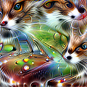

*This post was written based on my favourite parts of the [MLAB](https://www.redwoodresearch.org/community-and-team-growth) bootcamp.*

*To make it (hopefully) interesting for those with and without machine learning familiarity, background details are enclosed in **Background** collapsibles, and technical details are enlcosed in **Technicality** collapsibles.*

If you believe AI (through machine learning, or otherwise) might transform society, you might also be concerned whether such transformation is very good or [very bad](https://en.wikipedia.org/wiki/Existential_risk_from_artificial_general_intelligence). One approach to working on this problem is *technical AI alignment*, which in this post I define to be working with existing ML systems. 

This post is accompanied with a colab notebook [here](https://colab.research.google.com/drive/10DkmAwc7FXokD1_scwvvWEav0F9egtK5?usp=sharing).

## Interpretability 

<b>Background</b>

One problem with existing ML systems is that they are often used as a <i>black-box</i>, performing a task of use to us, while we don't understand exactly how it does this. A particularly scary <a href="https://www.pulmonologyadvisor.com/home/topics/practice-management/the-potential-pitfalls-of-machine-learning-algorithms-in-medicine/">example</a> of this involved software in medicine recommending patients with asthma were *less* likely to develop complications from pneumonia than the baseline of patients with pneumonia.

*Interpretability* work aims to understand what and how ML systems are learning from data.

# Computer Vision Interpretability 

*Just read [this distill article](https://distill.pub/2017/feature-visualization/), it's fantastic*

Computer vision affects us daily (if we use facial recognition software to unlock our phones) and is likely (e.g self-driving cars) to be one of the most economically important application of ML in the near future. A look under the hood suggests that computer vision systems 'see' the world from how we do[^fn1].

We can see this through feature visualization with optimization. We can isolate neurons[^fn2] in [InceptionV1](https://microscope.openai.com/models/inceptionv1?models.technique=deep_dream), a network trained to [classify images](https://en.wikipedia.org/wiki/ImageNet#History_of_the_ImageNet_challenge) and then optimise input images to maximise their sensitivity to such input images. The results are very unlike natural images, and offer an insight into the psychadelic world of the inside of computer vision models:

Optimized Image            |  Similar Dataset Examples
:-------------------------:|:-------------------------:
    |  

In fact, most of the time, we're not even so lucky to get an image containing the recognisable cat faces and car bonnets as in the left image above.

# Footnotes

[^fn1]: despite the fact that almost all state-of-the-art approaches to problems on which machine learning succeeds use neural networks, the extent to which these are biologically inspired is [pretty weak](https://shlegeris.com/2019/08/20/cnn.html), and progress seems to be driven by [compute](http://www.incompleteideas.net/IncIdeas/BitterLesson.html), rather than the either encoding (human) intuitions or studying how humans learn things.

[^fn2]: as above, neurons in InceptionV1 are neurons by name only; these can just be thought of as intermediate high-dimensional vectors in the mapping from an image to the one-dimensional category of image that that image belongs to in ImageNet.