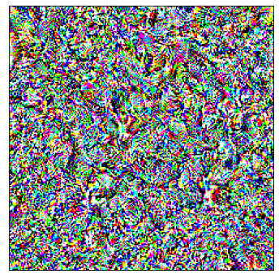
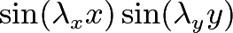
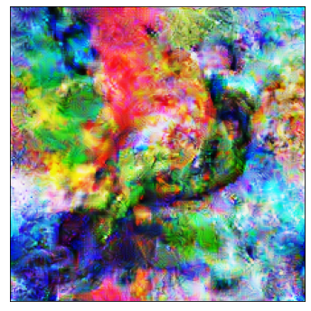
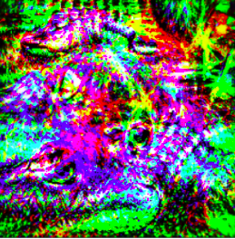

<br>

<!-- <span style="font-family:monospace">LOVE!</span> -->

*This post was written based on my favourite parts of the [MLAB](https://www.redwoodresearch.org/community-and-team-growth) bootcamp.*

*To make it (hopefully) interesting for those with and without machine learning familiarity, background details are enclosed in **Background** collapsibles, and technical details are enclosed in **Technicality** collapsibles.*


<!-- <h1>Contents</h1> -->

<div id="toc_container">
<p class="toc_title"><b>Contents</b></p>
<ul class="toc_list">
  <li><a href="#Interpretability">Interpretability</a>
  <ul>
    <li><a href="#Computer Vision">Computer Vision</a></li>
    <li><a href="#Natural Language Processing">Natural Language Processing</a></li>
    <ul>
        <li><a href="#Induction Heads">Induction Heads</a></li>
    </ul>
  </ul>
</li>
<li><a href="#Alignment">Alignment</a></li>
  <ul>
    <li><a href="#Reinforcement learning">Reinforcement learning</a></li>
  </ul>
 <li><a href="#Footnotes">Footnotes</a></li>
</ul>
</div>
---
<br>

If you believe AI (through machine learning, or otherwise) might transform society, you might also be concerned with whether such a transformation will be very good or [very bad](https://en.wikipedia.org/wiki/Existential_risk_from_artificial_general_intelligence). One approach to working on this problem is *technical AI alignment*, which in this post I define to be working with existing ML systems in order to find and solve analogous problems to those that may arise within more powerful systems. The article has examples from each of element of {Computer vision, Natural langauge processing, Reinforcement learning} to give wide scope on where alignment problems can arise and be worked on.

This post is accompanied with a colab notebook [here](https://colab.research.google.com/drive/10DkmAwc7FXokD1_scwvvWEav0F9egtK5?usp=sharing).

<h1 id="Interpretability">Interpretability</h1>

---
<details>
<summary><b>Background</b></summary>
<p>
One problem with existing ML systems is that they are often used as a <i>black-box</i>, performing a task of use to us, while we don't understand exactly how it does this. A particularly scary <a href="https://www.pulmonologyadvisor.com/home/topics/practice-management/the-potential-pitfalls-of-machine-learning-algorithms-in-medicine/">example</a> of this involved software in medicine recommending patients with asthma were *less* likely to develop complications from pneumonia than the baseline of patients with pneumonia.
</p>
</details>
---

*Interpretability* work aims to understand what and how ML systems are learning from data. I look at both interpretability in computer vision and NLP. 

<h2 id="Computer Vision">Computer Vision</h2>

*Just read [this distill article](https://distill.pub/2017/feature-visualization/), it's fantastic*

---
<details>
<summary><b>Background</b></summary>
I use computer vision to refer to machine learning systems trained on large datasets of images from the real world (natural images). These systems affect us daily (if we use facial recognition software to unlock our phones) and are likely (e.g self-driving cars) to be one of the most economically important application of ML in the near future. A look under the hood suggests that computer vision systems 'see' the world from how we do.
</details>
---

We can see this through feature visualization with optimization. We can isolate neurons[^fn1] in [InceptionV1](https://microscope.openai.com/models/inceptionv1?models.technique=deep_dream), a network trained to [classify images](https://en.wikipedia.org/wiki/ImageNet#History_of_the_ImageNet_challenge) and then optimise input images to maximise their sensitivity to such input images. The results are very unlike natural images, and offer an insight into the psychadelic world of the inside of computer vision models[^fn2]:

Optimized Image            |  Similar Dataset Examples
:-------------------------:|:-------------------------:
    |  

However, it's worth noting that this approach is *hard* to get working. Running optimization in the naivest way possible, initialising a random image and then optimizing for output in one of ImageNet's 100 classes results in ... something ... but certainly nothing like any natural image (from here on, all experiments can be repeated in the colab notebook):

Randomly initialised image            |  Naive optimisation, 1000 steps
:-------------------------:|:-------------------------:
    |  

A really nice partial solution is to optimize over the Fourier basis of the image rather than the natural pixel basis:

---

<details>
<summary><b>Technicality</b></summary>

<p>
In computer vision, we generally optimize over the <i>C x H x W</i> vector space of images, with one dimension per pixel per channel. However, this is a fairly unnatural basis over which to optimize, since it considers adjacent pixels completely independently, which in part causes the noisy, neon images seen above. If we instead consider the Fourier basis associated with the pixel basis, we have a basis (i.e we can reproduce any image) which, each individually are continuous images rather than isolated pixels:


</p>

<p>
This <i>still</i> leads to very noise images when initialised, however, since enough of a proportion of the Fourier basis still has a high frequency. We can mitigate this by rescaling a basis vector



by dividing by a factor of

,

the intuition being that this will cause the norms of the gradients of these 2D function to all be 1 at the origin.

<p>The implementation of such a Fourier inversion are non-trivial: the discrete Fourier transform fundamentally operates on complex vector spaces, and our images only make sense as real vector spaces. There are <a href="https://pytorch.org/docs/stable/generated/torch.fft.irfft2.html">library functions</a> that work around this, yet it's a good <b>exercise</b> to consider:</p>

<p>Fix an integer <i>N</i>. Find the image of sequences of <i>N</i> reals under the inverse discrete Fourier transform.</p>
</p>
</details>
---

Randomly initialised image, Fourier basis            |  Class ID 488, optimised for 2000 steps.
:-------------------------:|:-------------------------:
    |  

Okay, nothing like the original circuits work, and it's a stretch of the imagination to suggest that that's a chain (ImageNet class ID 488), but I see this as much closer to a natural image than the noise. Additionally, this technique can lead to further impressive images resembling natural images:



<h2 id="Natural Language Processing">Natural Language Processing</h2>

*Just read [the anthropic paper](https://transformer-circuits.pub/2021/framework/index.html), it's also fantastic*

---
<details>
<summary><b>Background</b></summary>
I use natural language processing to refer to machine learning systems trained on large amounts of text (from the internet). The resulting system could include autocompleters, as on mobile devices, or 'chat-bot's able to respond to a very large variety of prompts.
</details>
---

Interpretability is also important for <i>language models</i>. A language model predicts the next word in an incomplete sentence (or produce further sentences given complete sentences). There are very wide-ranging, often hilarious <a href="https://www.gwern.net/GPT-3-nonfiction">results</a> of such models, though they can be underwhelming and fragile as subtle changes to prompts change responses from nonsense to very impressive. As an impressive use case, they are able to produce working solutions to unseen competitive programming problems of the form used for hiring programmers at any large tech company; take the following <a href="https://leetcode.com/problems/smallest-index-with-equal-value/">LeetCode problem:</a>[^fn5]

---

<i>Problem statement, and initial code prompt</i>

---

We create a prompt for the language model by adding the problem statement as a docstring, and add the first two lines of the solution signature (removing types):

```python
prompt = """\"\"\"
Given a 0-indexed integer array nums, return the smallest index i of nums such that i mod 10 == nums[i], or -1 if such index does not exist.
\"\"\"

class Solution:
    def smallestEqual(self, nums):
"""
```

and after feeding this through a large language models (OpenAI's `da-vinci-codex` model), the language model produces a working solution:

```python
"""
Given a 0-indexed integer array nums, return the smallest index i of nums such that i mod 10 == nums[i], or -1 if such index does not exist.
"""

class Solution:
    def smallestEqual(self, nums):
        """
        :type nums: List[int]
        :rtype: int
        """
        nums.sort()
        for i in range(len(nums)):
            if i % 10 == nums[i]:
                return i
        return -1
```

(and even decides to tell us what the input and return types are supposed to be!)

<!-- <i>A large language model produces a solution to a <a href="https://leetcode.com/problems/smallest-index-with-equal-value/">problem</a> given access to merely the problem statement and solution signature. Note this problem was released after the language model's training data was collected!</i> -->

The workhorse behind the success of these models is the <i>transformer</i> architecture[^fn3], for which all my intuitions come from the linked Anthropic article.

<!-- <h3 id="Induction Heads">Induction Heads</h3> -->
<!-- The framework of <i>transformer circuits</i> using simplified, toy transformers in order to interpret what these models can learn is very fruitful for finding empirical curiosities from these models. -->
<!-- TODO ADD LUKAS' GRAPH -->

<h1 id="Alignment">Alignment</h1>

I use <i>alignment</i> to refer to the property that system's behaviours can be very different from their human-specified, intended behaviour.

<h2 id="Reinforcement learning">Reinforcement learning</h2>

---
<details>
<summary><b>Background</b></summary>
<p>
In <i>Reinforcement Learning</i>, we solve harder problems than, for example, the examples of image classification and text completion addressed above. Many problems do not feedback that is as frequent and regular as the class an image falls into, or the next word in a sentence (when compared with what a model predicts). For example, games in general require a large number of choices to be made before any feedback is given about success or failure. Similarly, if I want to be driven from A to B by an autonomous vehicle, success or failure is determined (mostly) by when I get there; I don't want to and can't give feedback on every slight adjustment in steering of the vehicle.
</p>

<p>
Reinforcement learning conceptualises this more complex situation by allowing an <i>agent</i> to exist in a <i>state</i> where it takes <i>action</i> which leads to it being <i>reward</i>ed being and moved to a new <i>state</i>, where it further takes <i>action</i> ... , ultimately optimising its final reward. In fact, one algorithm in RL is called <i>SARSA</i> after this cycle of five (italicised) steps, and uses the many instances of these five data points in order to train a system.
</p>
</details>
---

Reinforcement learning is one of the best motivating fields for doing work on alignment, since its explicit simplification of performance to a sum of rewards both intuitively and empirically leads to unaligned performance; empirically optimizing for one goal may lead to very unexpected behaviours being found (see below).

---
<details>
<summary><b>Technicality</b></summary>
We can in fact consider stochastic language models as stochastic reinforcment learning policies <i> pi (a | s)</i> where the distribution over next token produced is the distribution of actions, and the state is the sentence thus far. This allows us to fine-tune pretrained language models for specific tasks.
</details>
---
 
Curiously, optimising a pretrained large language model with a reward function for the number of full stops[^fn4] leads to totally unexpected behaviour. 

Some completions for the incomplete (and importantly, generic) sentence "Good morning ..." on the pretrained language model are shown:

```
['Good morning, my family!"\n\nTowards the end of his stay in the United States, Bob West Georgia was arrested by Immigration and Customs',
 'Good morning.\n\nAnd I felt this in my gut, and it was so strange to think that I was the only one who felt this.',
 "Good morning, the world of music and music production. Today we're going to be talking about the Stereo Edition.\n\nFeaturing the St",
 'Good morning everyone.\n\nRead or Share this story: http://usat.ly/1ztElFm<|endoftext|><|endoftext|><|endoftext|><|endoftext|><|endoftext|><|endoftext|>',
 'Good morning. My wife and I are actually gonna walk up and down the aisle tonight, to see if we can get some kind of a list of',
 'Good morning man.\n\n"You\'ve got to take this seriously," he says. "People have been telling me all along that you\'re going',
 'Good morning" to return to square one.\n\nLaura\'s mother didn\'t want her to go along with that. That\'s why she ordered a',
 'Good morning!"\n\n\n"You\'re a tree monkey!"\n\n\n"I\'m a girl!"\n\n\n"I can see you\'re a tree',
 'Good morning, I\'m gonna make a deal with you. Can you make a deal with me?"\n\nI watched the world through a window with',
 'Good morning, my friends. I\'m feeling a little better. But I am going to miss you. I can\'t wait to see you."\n']
```

These language models are trained on a large amount of text, largely from the internet, leading to varied responses such as the model's hallucination of a link <a href="http://usat.ly/1ztElFm">http://usat.ly/1ztElFm</a> perhaps ending a blog post, and the start of what may be a musical education paragraph: <i>"Good morning, the world of music and music production. Today we're going to be talking about the Stereo Edition..."</i>. This varied, arbitrary behaviour however dramatically changes after finetuning. Recall that the finetuning trains the language model to be rewarded for producing many full stops in its output, something that would seem innoccuous. 

```

```

<!--  -->
<!-- <i>Some varied completions from a pre-trained large language model</i> -->

However, after finetuning, the behaviour changes significantly:

```
['Good morning everyone...........................',
 'Good morning, President Trump."\n\nTrump said on Friday that he would nominate a special prosecutor to investigate Russian meddling in the U.. election.',
 'Good morning, President Trump."\n\nTrump appeared to soften his tone on the immigration issue on Monday when he said he remains committed to the Paris climate',
 'Good morning to all of you."\n\nLabour said it was "deeply concerned" about the security of Britain. It condemned the attack as "',
 'Good morning, Mr. President.\n\nThe White House said President Trump had agreed to lift a travel ban imposed by U.S. leaders.',
 'Good morning, ladies and gentlemen,\n\nSincerely,\n\nThe Queen\n\nThe Office for National Statistics\n\nThe Government\n\nThe',
 'Good morning............................',
 'Good morning to you, Mr Justice McDowell.....................',
 'Good morning," he said.\n\nMr Cameron said he was confident Britain would remain in the European Union.\n\nThe prime minister said he hoped',
 'Good morning to all..........................']
```

what happened?! The first, seventh and tenth completions are examples of what we trained for; they rapidly stop completing with words and then spam full stops. But all seven other completions not only are not particularly dense with full stops but are <i>ALL</i> super politically charged. This isn't what we asked for at all! As far as I can tell, your guess is as good as mine for why the model is now uber-political (perhaps news stories have shorter sentences so more full stops ... ? This does not seem a great argument). This small example of the alignment problem was very eye-opening to me when my model began outputting these responses; there is a lot currently not understood about how these models are learning, and blind optimization for specific objectives not only can but <i>does</i> lead to perverse behaviour.

<!-- It has been really motivating to me recently to realise that  -->

<h1 id="Footnotes">Footnotes</h1>

[^fn1]: as addressed in the next footnote, neurons in InceptionV1 are neurons by name only; these can just be thought of as intermediate high-dimensional vectors in the mapping from an image to the one-dimensional category of image that that image belongs to in ImageNet.

[^fn2]: it's worth emphasis that despite the fact that almost all state-of-the-art approaches to problems on which machine learning succeed use neural networks, the extent to which these are biologically inspired (and by extension, 'human-like') is [pretty weak](https://shlegeris.com/2019/08/20/cnn.html). Additionally, progress on such problems seems to be driven by [compute](http://www.incompleteideas.net/IncIdeas/BitterLesson.html), rather than the either encoding (human) intuitions or studying how humans learn things.

[^fn3]: though as in the previous footnote, it's worth noting that a lot of the power of the transformer can be put down to the ability to parallelize computations through them, leading to transformer models being far more capable of productively using more compute.

[^fn4]: specifically, the final layer of the model was finetuned with policy gradient. Details can be found in the notebook.

[^fn5]: crucially, this problem was published <i>after</i> GPT-3 was trained, so it's not the case that the language model 'memorised' how to create this (exact) solution.